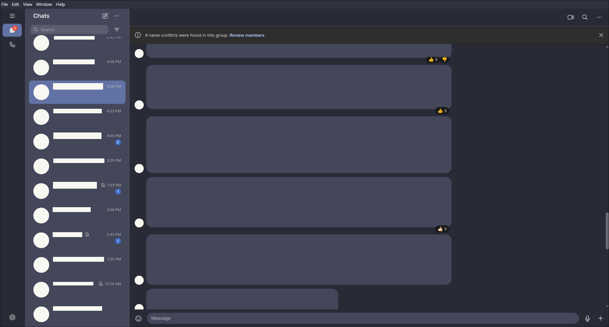

# Dracula for [Signal](https://signal.org)

> A dark theme for [Signal desktop](https://signal.org).

Inspired by [Catppuccin themes for Signal Desktop](https://github.com/CalfMoon/signal-desktop).

## Install

All instructions can be found at [draculatheme.com/signal](https://draculatheme.com/signal-desktop).

## Team

This theme is maintained by the following person(s) and a bunch of [awesome contributors](https://github.com/dracula/signal-desktop/graphs/contributors).

|  |
| ------------------------------------------------------------------------------------------ |
| [CharlieTUX](https://github.com/charlieTUX)                                                |

## Community

- [Twitter](https://twitter.com/draculatheme) - Best for getting updates about themes and new stuff.
- [GitHub](https://github.com/dracula/dracula-theme/discussions) - Best for asking questions and discussing issues.
- [Discord](https://draculatheme.com/discord-invite) - Best for hanging out with the community.

## Dracula PRO

## License

[MIT License](./LICENSE)
